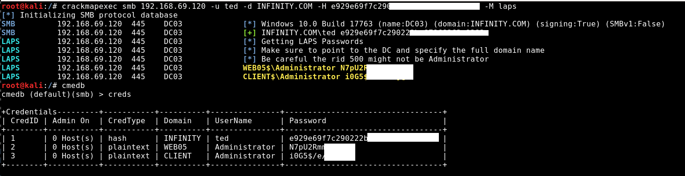

# Crackmapexec-LAPS
LAPS module for CrackMapExec

Make sure to point to the DC   
**Specify the full domain name** 
Be careful the rid 500 might not be "Administrator" 

Usage: 
crackmapexec smb IP -u USER -d DOMAIN.COM -H NTLM-HASH -M laps 
crackmapexec smb IP -u USER -d DOMAIN.COM -p CLEAR-TEXT -M laps 

Module by technobro
      Grazie: per CME
byt3bl33d3r
@snowscan
@HackAndDo
      
Credit:
      @n00py1
      Credit Reference: https://www.n00py.io/2020/12/dumping-laps-passwords-from-linux/
      Credit https://github.com/n00py/LAPSDumper
